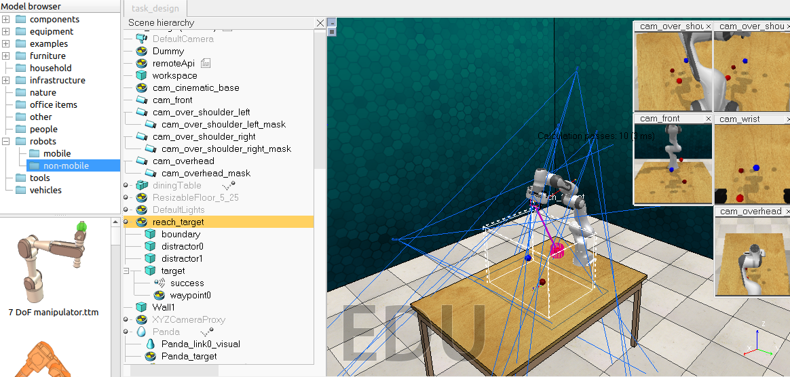

# 要求
1. 安装部署RLBench仿真环境。成功运行example，出现可视化界面。
2. 阅读示例代码，理解关于机械臂运动控制的代码。尝试读取task的obs，进一步理解相关数据。
3. 尝试从单个task中读取15-20个episode数据，并建立小型数据集。
4. 尝试设计简单的behavior cloning算法，使机械臂完成相关任务。

## 运行example

## 理解代码
[RLBench项目提供的Youtube简易指南——学习过程](./learn.md)
