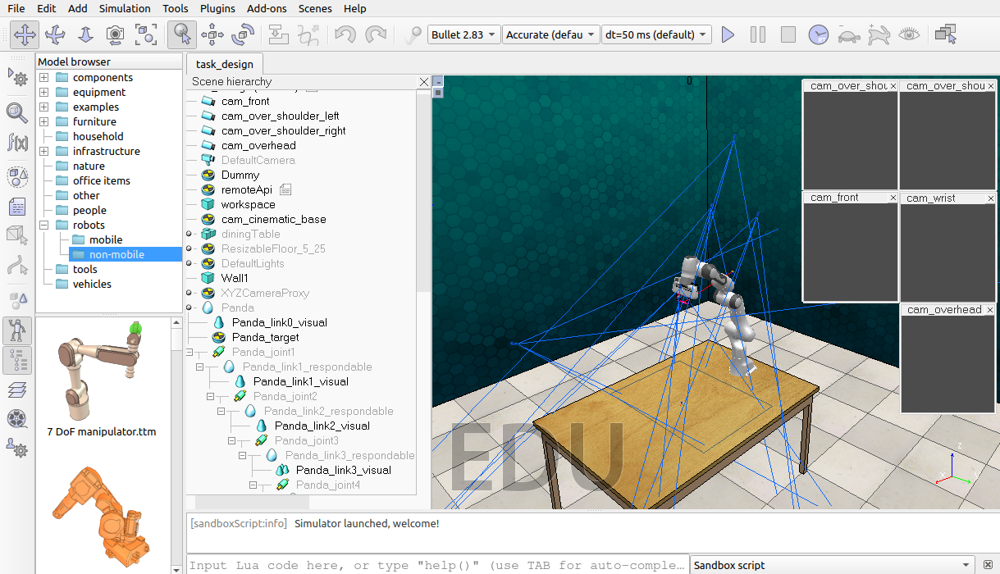

# [RLBench Task Building Tutorial - Target Reaching (Part 1)](https://www.youtube.com/watch?v=bKaK_9O3v7Y&t=110s)
1. 克隆RLBench仓库
    ```shell
        git clone https://github.com/stepjam/RLBench.git
    ```

2. 运行tools/task_builder.py

    

    ```python
    from typing import List, Tuple
    from rlbench.backend.conditions import DetectedCondition
    from rlbench.backend.task import Task

    # 所有tasks都从Task类继承
    class D5error(Task):

        def init_task(self) -> None:
            # TODO: This is called once when a task is initialised.
            success_sensor = ('success')
            self.register_success_conditions([
                DetectedCondition(self.robot.arm.get_tip(), success_sensor)
            ])

        def init_episode(self, index: int) -> List[str]:
            # TODO: This is called at the start of each episode.
            return ['rea h the red target', 'reach the red thing']

        def variation_count(self) -> int:
            return 1

        def base_rotation_bounds(self) -> Tuple[List[float], List[float]]:
            return [0.0, 0.0, 0.0], [0.0, 0.0, 0.0]
    ```

# [RLBench Task Building Tutorial - Target Reaching (Part 2)](https://www.youtube.com/watch?v=CSUZ7L50bD8)

# [RLBench Task Building Tutorial - Target Reaching (Part 3)](https://www.youtube.com/watch?v=iddr7sgyoJY)